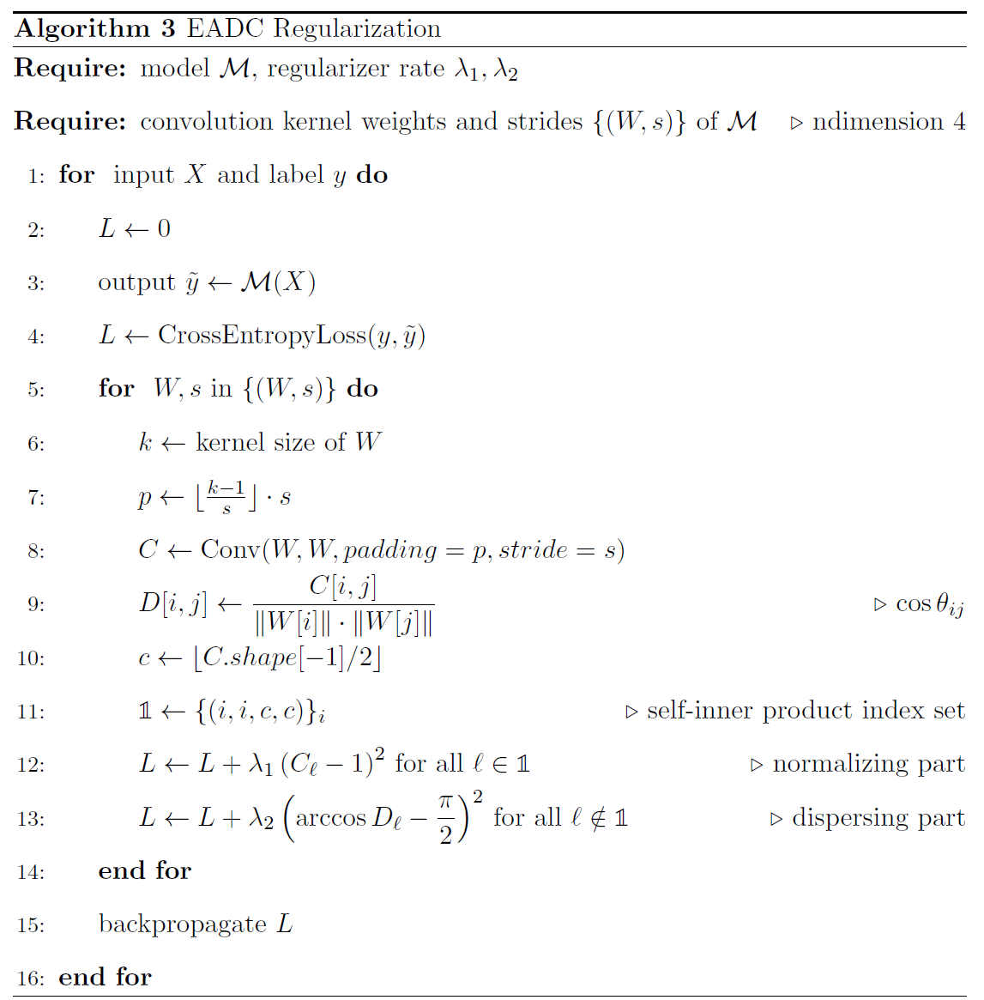

# Dispersed Kernel Regularization

> PyTorch implementation of **topology- and angle-based kernel regularization techniques** for convolutional neural networks.  
> This work introduces **PH0**, **MST**, **EADK**, and **EADC** to generalize orthogonality and improve feature diversity, especially in overcomplete CNN settings.

---

## Overview

Deep convolutional neural networks (CNNs) show strong performance across vision tasks, but often suffer from:

- **Gradient vanishing or explosion**
- **Redundant feature extraction**
- **Poor filter diversity**

While orthogonality-based methods try to mitigate these, they:

- Are ineffective in overcomplete (non-square) kernels  
- Show weak angular dispersion near convergence

This project introduces **dispersing-based regularizations** using geometric and topological principles, outperforming prior approaches in both theory and practice.

---

## Key Contributions

- **PH0 & MST**: Use persistent homology and minimum spanning tree distances to enforce topological dispersion.
- **EADK & EADC**: Introduce angle-based regularizations that directly penalize deviation from orthogonality.
- **Empirical Gains**: Achieve state-of-the-art results on CIFAR-10, CIFAR-100, and SVHN with ResNet and WideResNet.
- **Theoretical Insights**: Analyze soft orthogonality and propose angular gradients that scale with deviation from π/2.

---

## Algorithms

  

  

  

---
## Benchmark Results

| Dataset    | Baseline | EADK (Best) | EADC (Best) |
|------------|----------|-------------|-------------|
| CIFAR-10   | 94.57%   | **95.20%**  | **95.35%**  |
| CIFAR-100  | 74.84%   | **77.79%**  | **78.78%**  |
| SVHN       | 96.86%   | **97.02%**  | **97.02%**  |

